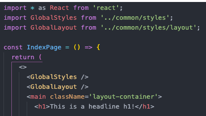

# Personal Website V2

This is the project about the second personal website of Andreas Rissling. Here you find all information you need to develop and build the website.

## Tech stack

<hr>

In this chapter only the main technologies of the project are listed. A detailed overview can be found in the _package.json_ file under the keys **dependencies** and **devDependencies**.

The whole project is based on **Gatsby** and written in **TypeScript.** Some configuration files are written in **JavaScript**. The main technologies are:

- [Gatsby](https://www.gatsbyjs.com/)
- [React](https://reactjs.org/)
- [TypeScript](https://www.typescriptlang.org/)
- [Styled-components](https://styled-components.com/)

To support the development process the technologies listed below are used:

- [Storybook](https://storybook.js.org/)
- [Jest](https://jestjs.io/)
- [React Testing Library](https://testing-library.com/docs/react-testing-library/intro/)
- [ESLint](https://eslint.org/)
- [Prettier](https://prettier.io/)
- [Husky](https://typicode.github.io/husky/#/)
- [Lint staged](https://github.com/okonet/lint-staged#readme)

## Requirements and Setup

<hr>

`npm` and `Node.js` are needed to installed on the local maschine. When is started this project i was using `npm` _v6.14.8_ and `Node.js` _v14.15.0_.

To get started clone the repository from github to your local maschine.

```
git clone git@github.com:arisslin/jsmpc.git
```

Then switch into the repo and install the projects dependencies.

```
cd personal-website-v2
npm i
```

## Developing

<hr>

For running the development server you can run following `npm` scripts in your console.

```
npm start
```

or

```
npm run develop
```

The site is now running at http://localhost:8000. You aslo find **GraphiQL**, an in-browser IDE, to explore the site's data and schema with `GraphQL` on http://localhost:8000/\_\_\_graphql

## Build and deploy

<hr>

To compile the app and make it ready for deployment use following command:

```
npm run build
```

Afterwards you will find in the projects root folder a folder named `./public`. Inside this folder you find the compiled site ready for deployment.

For testing the compiled site you can run a production server on your local maschine. Therefor type the command below into you console:

```
npm run serve
```

You can view the site in the browser now on http://localhost:9000/

## Cleanup

<hr>

If the local project has issues `Gatsby` provides a clean up script.

```
npm run clean
```

For more information read the documentation on https://www.gatsbyjs.com/docs/reference/gatsby-cli/#clean

## ESlint

<hr>

`ESlint` is used for statically analyzing the code and finding problems. It scans all _\*.js,_ _\*.jsx,_ _\*.ts_ and _\*.tsx_ files in the repository. You can run the linter manually over following script:

```
npm run lint
```

`husky` and `lint-staged` are used to automate the eslint by hooks.
There is a hook that runs before every push on all project files.

## Storybook

<hr>

`Storybook` is used for isolated developmend of React components and for documentation. You can start storybook with followin command from the repo:

```
npm run storybook
```

You can also run `Storybook` as a static web application. Therefore you need
to create a build.

```
npm run build-storybook
```

## Testing

<hr>

For unit testing `jest` and `testing-library` is used. To run the tests start following script:

```
npm run test
```

To start testing with coverage run:

```
npm run test:coverage
```

## Prettier

<hr>

For formatting and prettifing code `Prettier` is used.
It runs an all _\*.js_, _\*.jsx_, _\*.ts_, _*.tsx*_, _\*.html_, _\*.css_,
_\*.md_ and _\*.mdx_ files.

You can run it over the whole project.

```
npm run prettier
```

There is hook for `husky` with `lint-staged` that runs `Prettier` before every git commit to on staged files.

## Global styles

<hr />

In this chapter is about the global styles which can be reused for styling the app. For styling `styled-components` is used. All global styles you can from `root` find in the folder `/src/common/styles/`.

### Basic global styles

All basic global styles stored in `index.tsx`

#### `GlobalStyles`

... in progress

### Layout

All global layout styles stored in `layout.tsx`

#### `GlobalLayout`

The component `GlobalLayout` consists of CSS utility class selectors that can be embedded into the JSX markup as needed. To use these selectors the component itself need get embedded as JSX-Element on top level of the page components.


